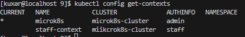
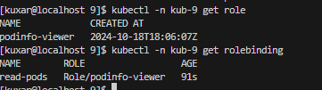
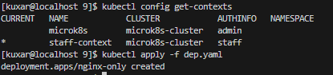
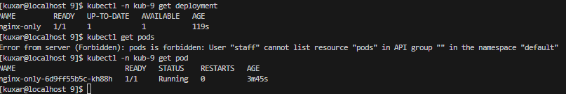
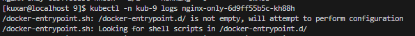
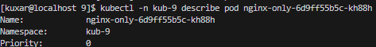

# kuber-09-AM

## 1. Создайте и подпишите SSL-сертификат для подключения к кластеру.
```
kubectl create namespace kub-9
```
создаю файл ключа
```
openssl genrsa -out staff.key 2048
```
Создаю запрос на подписание сертификата
```
openssl req -new -key staff.key -out staff.csr -subj "/CN=staff/O=manager"
```
Генерирую файл сертификата
```
openssl x509 -req -in staff.csr -CA /var/snap/microk8s/current/certs/ca.crt -CAkey /var/snap/microk8s/current/certs/ca.key -CAcreateserial -out staff.crt -days 365
```
## 2. Настройте конфигурационный файл kubectl для подключения
   
Создаю пользователя staff и настраиваю его на использование созданного выше ключа:
```
kubectl config set-credentials staff --client-certificate=staff.crt --client-key=staff.key
```
Создаю новый контекст с именем staff-context и подключаю его к пользователю staff
```
kubectl config set-context staff-context --cluster=microk8s-cluster --user=staff
```
проверка
```
kubectl config get-contexts
```

## 3. Создайте роли и все необходимые настройки для пользователя
 включаю встроенный в Microk8s RBAC контроллер
```
microk8s enable rbac
```
Применяю манифесты

kubectl -n kub-9 apply -f [role.yaml](yaml/role.yaml)

kubectl -n kub-9 apply -f [brole.yaml](yaml/brole.yaml)

проверка
```
kubectl -n kub-9 get role
kubectl -n kub-9 get rolebinding
```


## 4. Предусмотрите права пользователя. Пользователь может просматривать логи подов и их конфигурацию (kubectl logs pod <pod_id>, kubectl describe pod <pod_id>).
Переключаюсь на контекст созданого пользователя
```
kubectl config use-context staff-context
```

Применяю деплоймент и проверяю работу контекста
```
kubectl apply -f [dep.yaml](yaml/dep.yaml)

kubectl -n kub-9 get deplotyment

kubectl -n kub-9 get pod
```


Проверяю логи пода
```
kubectl -n kub-9 logs nginx-only-6d9ff55b5c-kh88h
```

```
kubectl -n kub-9 describe pod nginx-only-6d9ff55b5c-kh88h
```


### 5.Манифесты :
[1. brole.yaml](yaml/brole.yaml)

[2. role.yaml](yaml/role.yaml)

[3. dep.yaml](yaml/dep.yaml)